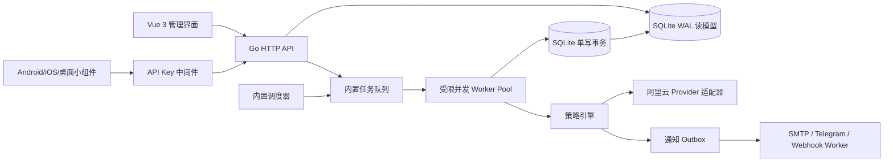

# CDT-Monitor 现状与重构架构分析

> 分析日期：2026-07-19  
> 分析范围：当前仓库 `main`（`v1.6.7`）及其 Docker、CI、前端和 PHP 运行代码。  
> 本文只记录理解和架构建议，不改变现有业务实现。

## 1. 结论摘要

当前项目是一个面向单机部署的 PHP 模块化单体：PHP-FPM 负责 Web 请求，`monitor.php` 由每分钟 Cron 触发，SQLite 保存全部配置、运行状态、统计、账单缓存和日志。功能完整度已经较高，但“外部 API 调用、策略执行、通知发送、数据库写入”都在同一个同步请求链路内，导致前台延迟、任务重叠和 SQLite 写锁竞争随账号数量增长而明显放大。

推荐的目标形态不是立即拆成多个微服务，而是：

**Go 模块化单体 + 单进程 HTTP 服务/内置调度器 + SQLite WAL + 内置 Vue 静态资源 + 异步任务队列/通知 Outbox + 单一最小容器镜像。**

这一形态适合当前“个人/小团队、单机、数据私有化、无需 MySQL/Redis”的定位，能够同时改善性能和部署体验，并保留未来迁移 PostgreSQL、增加多副本和扩展移动端 API 的路径。极致镜像方案使用静态 Go 二进制、`scratch`（或 distroless/static）运行时，不再捆绑 Nginx、PHP-FPM、dcron 和 shell 启动编排。

Rust + Axum 也可以得到更小的二进制，但需要自行实现或维护更多阿里云 RPC 签名和 SDK 适配，迁移风险与维护门槛更高。因此本项目优先选择 Go；只有在镜像体积成为第一约束且团队具备 Rust 能力时，才建议评估 Rust 版本。

## 2. 当前项目整体理解

### 2.1 运行与依赖

| 层次 | 当前实现 | 事实来源 |
| --- | --- | --- |
| Web 入口 | `index.php`，基于 `action` 查询参数手工分发接口和页面 | `index.php:14-200` |
| 业务编排 | `AliyunTrafficCheck`，同时承载登录、配置、状态查询、监控循环、手动控制、账单和日志 | `AliyunTrafficCheck.php:12-835` |
| 配置/缓存 | `ConfigManager`，启动时把 `settings` 和全部 `accounts` 一次性读入内存 | `ConfigManager.php:9-24` |
| 存储 | PDO SQLite，启动时建表、补列和迁移 | `Database.php:8-214` |
| 云厂商 | Alibaba Cloud PHP SDK；CDT、ECS、BSS 共用 `AliyunService` | `AliyunService.php:117-390` |
| 通知 | PHPMailer SMTP、Telegram Bot（支持自定义 URL/SOCKS5 代理）、自定义 Webhook | `NotificationService.php:102-403` |
| 前端 | Vue 3 全局构建版、ECharts、预编译 Tailwind，全部由本地静态文件提供 | `template.html:1-1612`、`static/` |
| 定时任务 | Docker 内置 dcron 每分钟执行 `monitor.php`；非 Docker 依赖系统 Crontab 或 URL 访问 | `Dockerfile:63-64`、`README.MD:132-166` |
| 容器 | Alpine + Nginx + PHP-FPM + dcron，同一容器中运行三个长期进程 | `Dockerfile:20-83`、`docker/entrypoint.sh:12-25` |

Composer 运行时依赖包括 `alibabacloud/client 1.5.32`、`phpmailer/phpmailer 6.11.1` 及 Guzzle、PSR、Symfony 等传递依赖。前端静态资源中 `echarts.min.js` 约 1.0 MB、Vue 约 162 KB、Tailwind CSS 约 79 KB；资源本身不是当前后端性能瓶颈，但 ECharts 可以在后续构建时按需裁剪。

### 2.2 数据模型

当前 SQLite 表及用途如下：

| 表 | 用途 | 关键问题/重构注意 |
| --- | --- | --- |
| `settings` | 全局设置键值对，包含管理员密码、阈值、停机模式、API 间隔、通知凭据等 | 类型全部是字符串；敏感字段明文；配置读取和更新边界不清晰 |
| `accounts` | 阿里云账号、地域、实例、流量上限、定时计划、站点类型和运行状态 | `access_key_secret` 明文；账号 ID 会在保存配置后被重排，不应继续作为历史外键 |
| `logs` | info/warning/error/heartbeat 日志 | 心跳每账号每分钟写入；每轮监控还会重排 ID，写放大严重 |
| `login_attempts` | 15 分钟窗口内登录失败次数 | 可保留，但应放到认证模块并增加过期清理和限速维度 |
| `traffic_hourly` / `traffic_daily` | 24 小时、30 天图表统计 | 已迁移为 `account_id`，需使用稳定账号 ID；增加时间和账号索引 |
| `billing_cache` | 余额、实例账单等 BSS 缓存 | 当前 6 小时缓存，适合改成异步刷新且不阻塞状态页 |

### 2.3 现有接口与用户工作流

`index.php` 当前接口可按访问边界分为：

- 初始化：`check_init`、`setup`。
- 登录：`login`、`check_login`、`logout`。登录成功后依赖 PHP Session。
- 状态与历史：`get_status`、`get_history`。
- 管理配置：`get_config`、`save_config`。
- 实例控制：`control_instance`、`refresh_account`。
- 通知测试：`send_test_email`、`send_test_telegram`、`send_test_webhook`。
- 日志：`get_logs`、`clear_logs`。
- 页面：无 `action` 时返回 `template.html`。

当前 UI 已覆盖以下功能：

1. 首次访问初始化向导、管理员密码设置和本地数据库创建。
2. 多阿里云账号聚合展示，账号、地域、实例、备注和流量上限配置。
3. 中国站与国际站选择；中国站显示 CNY，国际站显示 USD。
4. 实例状态、流量使用百分比、阈值展示和单账号刷新。
5. 普通停机（`KeepCharging`）与节省停机（`StopCharging`）。
6. 阈值动作：超限自动停机并通知，或只发送告警。
7. 抢占式实例保活，在允许运行的时间窗口内检测到停止时尝试启动。
8. 每日定时开机、关机，以及可选的计划通知。
9. SMTP、Telegram（自定义反代/SOCKS5）和自定义 GET/POST Webhook 通知。
10. 24 小时/30 天流量图表、动作日志/心跳日志、日志清空和账单信息。
11. Docker 部署、外部 Crontab、第三方 URL Cron 三种触发方式。

### 2.4 监控主循环的实际行为

`AliyunTrafficCheck::monitor()` 的一轮流程是：

1. 清理日志和统计；重排日志 ID；每天 04:00 可能执行 SQLite `VACUUM`。
2. 遍历所有账号。
3. 若当前时间字符串恰好等于计划时间，执行开机或关机，并同步发送通知。
4. 根据上次更新时间和状态决定是否调用 CDT 流量 API、ECS 状态 API；过渡状态一般按 60 秒刷新，稳定状态按配置的 `api_interval` 刷新，整点强制刷新。
5. 流量达到阈值时，按策略自动停机或告警，并同步发送通知。
6. 保活打开、未超阈值且位于允许时间窗口时，若实例为 `Stopped` 则启动并通知。
7. 写入当前账号状态、小时/日统计和 heartbeat 日志，最后更新 `last_monitor_run`。

API 失败时会在 `AliyunService` 中进行最多 3 次重试，指数等待并加入随机抖动；状态未知还会在上层额外等待 0.5 秒重试。单轮执行因此可能被远程 API 超时和通知超时长时间阻塞。

## 3. 已识别的性能、可靠性和安全瓶颈

### 3.1 前台请求承担外部 API 调用

`get_status` 不是纯读操作。若缓存过期，它会在浏览器请求内调用 CDT 和 ECS；打开账单后还会调用余额和实例账单接口。账号数为 `N` 时，前台请求最坏接近 `N ×（流量 + 状态 + 账单接口）` 次串行网络访问，每次还有 5～15 秒超时和重试等待。

结果是：页面刷新延迟随账号数线性增长；移动端网络不稳定时更明显；前台请求可能与 Cron 同时修改 SQLite，增加锁冲突。

### 3.2 监控任务是单线程串行 I/O

所有账号按数组顺序串行处理。一个异常账号的重试会拖延后续账号，可能让定时开关机错过精确分钟。通知发送也是同步操作，SMTP、Telegram、Webhook 最多可连续阻塞约 10 秒/渠道。

### 3.3 没有任务重叠保护和动作幂等键

Docker Cron、外部 Cron、URL Cron 或多个容器实例可以同时进入 `monitor()`。当前没有全局租约或分布式锁，可能重复调用开关机和重复告警。定时条件使用“当前时间恰好等于 `HH:mm`”，任务延迟或容器重启时可能错过执行。

### 3.4 SQLite 写放大

- 每个账号每分钟至少追加一条 heartbeat 日志。
- 每次监控都调用 `reorderLogsIds()`，包含临时表、删除、重置序列和全量插回。
- 配置保存后 `reorderIds()` 删除并重插全部账号，使账号自增 ID 不稳定。
- 每日 04:00 的 `VACUUM` 会独占数据库。

WAL 只能改善读写并发，不能把 SQLite 的单写者限制变成多写者；上述全表操作会放大锁等待和磁盘写入。

### 3.5 缓存作用域有限

`AliyunService` 的流量和余额缓存只存在于一次 PHP 进程实例中。PHP-FPM 请求结束后缓存消失，Cron 进程和 Web 进程互不共享，真正跨请求的缓存只有部分账单数据和账号状态。

### 3.6 容器启动和信号处理复杂

当前镜像同时包含 Nginx、PHP-FPM、dcron、PHP 扩展和 Alpine 用户态。`entrypoint.sh` 以后台方式启动 Cron 和 PHP-FPM，再以前台 Nginx 保活，缺少统一的子进程回收、健康检查和优雅停止处理。日志配置注释声称输出到 Docker，但 Nginx 实际写入容器内日志文件。

### 3.7 当前接口和凭据边界不适合移动端

- `get_status`、`check_init` 等接口在 Session 鉴权前执行；状态页会公开返回账号掩码、地域、用量和可能的账单信息。
- Cron URL 使用管理员密码作为 `key` 查询参数，容易进入访问日志、代理日志和浏览器历史。
- 管理员密码、阿里云 Secret、SMTP/Telegram/Webhook 凭据存储在 SQLite 明文；配置接口还会把密码字段返回给前端。
- 认证是单一 Session，无 API Key、权限范围、轮换、撤销或设备级审计能力。
- 没有看到 CSRF token、API 限流、结构化审计事件或请求幂等键。

这些问题不妨碍当前单机使用，但必须在暴露 Android、iOS、桌面小组件 API 前解决。

## 4. 推荐的目标架构

### 4.1 总体形态：模块化单体，不做第一阶段微服务拆分

推荐保留“单机一个数据目录、一个容器、一个管理入口”的产品体验，但把运行时改成一个 Go 进程：



模块边界建议如下：

```text
cmd/cdt-monitor
  ├─ serve             HTTP + 静态资源 + 调度器 + Worker
  ├─ migrate           数据库迁移、导入和备份检查
  └─ run-once          兼容 CLI Cron 的单轮执行

internal/
  ├─ http              路由、JSON DTO、错误码、鉴权、限流、健康检查
  ├─ auth              管理员 Session、Argon2id、API Key、权限范围
  ├─ domain            Account、Schedule、Policy、RuntimeState、Event
  ├─ scheduler         租约、到期扫描、定时计划、重试和幂等
  ├─ policy            阈值熔断、保活、时间窗口和动作决策（纯函数）
  ├─ provider/aliyun   CDT、ECS、BSS、站点端点、签名、重试、熔断
  ├─ notification      SMTP、Telegram、Webhook 和 Outbox 投递
  ├─ store             SQLite schema、migration、repository、transaction
  └─ web               go:embed 的 Vue 构建产物
```

这样既能在一个进程内减少 IPC、容器和运维复杂度，也把以后替换 PostgreSQL、增加消息队列或拆分 Worker 的边界提前固定下来。

### 4.2 并发和任务模型

1. **前台只读缓存。** `GET /api/v1/accounts`、状态页和 widget API 只读最近一次已落库快照，不直接调用阿里云。
2. **刷新变成任务。** 手动刷新返回 `202 Accepted + job_id`，由 Worker 调用云 API，前端按 job 状态或短轮询读取结果。旧 UI 可以继续在按钮上显示“刷新中”。
3. **受限并发。** Worker Pool 默认 4～8 个并发，按账号和接口设置令牌桶或信号量；同一账号动作使用互斥键，避免重复 Start/Stop。
4. **超时和重试。** 所有外部调用使用请求级 `context`；连接超时、总超时、429/5xx、网络错误分类重试，4xx 鉴权错误不重试；连续失败触发按账号或端点的短暂熔断。
5. **调度租约。** SQLite 表记录 `scheduler_lease`，使用原子更新和过期时间；单容器由进程内调度器持有，误启动多个副本时只有一个实例执行自动化任务。
6. **计划不依赖精确相等。** 以 `next_run_at` 或“当天动作已执行事件”判定，容器重启后可补偿一次；事件键 `account_id + local_date + action` 保证幂等。
7. **通知异步化。** 策略动作只写 `notification_outbox`，通知 Worker 负责发送、重试、去重和记录结果。云 API 不应等待 SMTP 或 Telegram。
8. **维护任务低优先级。** 日志、统计和账单清理由后台维护任务执行，禁止每轮重排 ID；`VACUUM` 改为显式维护或低峰期可选任务。

### 4.3 存储方案

第一阶段继续使用 SQLite，原因是原项目的核心价值就是无需外部数据库，且账号规模通常较小。建议：

- 保留 WAL；设置 `busy_timeout`、`foreign_keys=ON`、合理的同步级别和事务边界。
- 使用版本化迁移表，所有 schema 变更可重复执行并可回滚或备份。
- 账号使用稳定 UUID 或永不重排的整数主键；删除采用软删除或归档，历史统计始终引用稳定 ID。
- 将设置拆成带类型的配置表或结构化配置对象；Secret 字段独立加密。
- 为 `(account_id, recorded_at)`、`logs(type, created_at)`、`job_runs(status, next_run_at)`、`notification_outbox(status, next_attempt_at)` 建索引。
- 心跳日志采用保留窗口和聚合指标；详细调试日志只在需要时开启，避免每分钟每账号一条无限增长。
- 写操作使用短事务；状态快照、事件、统计和 Outbox 在同一事务内提交，保证“动作成功但没有通知或审计”的情况可恢复。

第二阶段如果出现多副本、账号数明显增长或需要独立 Worker，再把 Repository 从 SQLite 切换到 PostgreSQL，并把 Outbox 投递到 NATS、Redis Streams 或云队列。业务层不应直接依赖具体数据库。

### 4.4 阿里云 Provider 适配

保持当前行为和端点映射，不在重构中改变语义：

- CDT `ListCdtInternetTraffic`：按国内或海外业务区域聚合流量；保留 `cn-*`（排除 `cn-hongkong`）的国内判定规则。
- ECS `DescribeInstanceStatus`、`StartInstance`、`StopInstance`：按账号地域使用 `ecs.<region>.aliyuncs.com`。
- 中国 BSS：region `cn-hangzhou`，host `business.aliyuncs.com`。
- 国际 BSS：region `ap-southeast-1`，host `business.ap-southeast-1.aliyuncs.com`。

优先使用成熟的 Alibaba Cloud Go SDK；如果 SDK 引入体积或跨平台问题，再封装官方 RPC 签名和 HTTP 客户端，但必须用录制响应或沙箱账号做契约测试。Provider 层只返回规范化结果，不把 SDK 响应结构泄漏给 API。

### 4.5 策略引擎和功能兼容

将现有 `monitor()` 中的条件判断抽为可测试的纯策略：

- `SchedulePolicy`：日计划、跨午夜时间窗、时区、补偿执行。
- `ThresholdPolicy`：阈值比较、停机模式、只告警或停机并通知、重复通知策略。
- `KeepAlivePolicy`：保活开关、计划时间窗、超阈值优先级、过渡状态保护、手动关机后的保活暂停。
- `InstanceActionPolicy`：手动操作、自动操作和过渡状态的冲突规则。
- `BillingPolicy`：余额和实例账单 6 小时缓存、按需或后台刷新、币种和站点映射。

推荐默认保持当前用户可见语义：超阈值不再重复发同一事件；如果必须完全兼容旧行为，提供 `repeat_warning` 兼容开关。保活失败继续按退避后重试，不恢复已经移除的固定冷却期，避免和当前版本行为不一致。

### 4.6 通知 Outbox

保留现有三个通道和全部参数：

- SMTP：Host、Port、用户名、密码、SSL/TLS 模式、收件人。
- Telegram：Bot Token、Chat ID、自定义 API URL、SOCKS5 代理及认证。
- Webhook：GET/POST、JSON/Form、自定义 Headers、Body 模板变量 `#TITLE#`、`#MSG#`、`#ACCOUNT#`、`#TRAFFIC#`、`#MAX_TRAFFIC#`。

每个事件生成稳定 `event_id`，Outbox 唯一键为 `event_id + channel`；失败记录错误和下一次重试时间。测试通知也走同一发送器，但限制目标地址和权限，避免前台长时间阻塞。

### 4.7 API Key 鉴权和小组件接口

新增版本化 API，不把管理员密码当作 API 凭据：

```text
GET  /api/v1/widget/summary
GET  /api/v1/accounts
GET  /api/v1/accounts/{id}/status
GET  /api/v1/accounts/{id}/history?range=24h|30d
POST /api/v1/accounts/{id}/actions/start
POST /api/v1/accounts/{id}/actions/stop
POST /api/v1/accounts/{id}/refresh
GET  /api/v1/jobs/{job_id}
GET  /healthz
GET  /readyz
```

鉴权建议：

- `Authorization: Bearer cdt_<random>` 为首选，也可兼容 `X-API-Key`。
- 数据库只保存 API Key 的哈希、名称、权限范围、创建时间、最后使用时间、过期时间和撤销时间。
- 小组件默认只授予 `widget:read`；实例控制需要单独的 `instance:control`；配置和密钥只允许 `admin`。
- API Key 只在创建时显示一次，可轮换、撤销和限制来源；所有控制操作写审计事件。
- 读接口返回已脱敏的状态快照，绝不返回 AK Secret、SMTP 密码、Telegram Token 或管理员密码。
- 返回 `ETag`、`Last-Modified`、`Cache-Control`，小组件无变化时得到 `304`，降低轮询量。
- 按 Key/IP 做限流，控制接口要求幂等键或服务端动作去重；默认关闭宽松 CORS，按配置允许移动端域名。

为兼容现有用户，保留 `/monitor.php?key=...` 的迁移兼容入口，但将它实现为受限 shim：建议迁移到专用 `legacy_cron` Key，响应只返回任务摘要；不再把管理员密码作为长期 URL 凭据。

### 4.8 认证、凭据和数据迁移

- 管理员密码改为 Argon2id（或 bcrypt）哈希；首次启动检测旧明文并在成功登录或迁移时转换。
- AK Secret、SMTP 密码、Telegram Token、Webhook 认证 Headers 使用环境提供的主密钥进行 AES-GCM 信封加密；主密钥不写入镜像，放在 Docker Secret、环境变量或受保护的数据卷。
- 当前 `data/data.sqlite` 首次启动前自动备份；迁移程序按复合业务键导入账号、设置、日志、统计和账单缓存。
- 迁移时建立旧账号 ID 到新稳定 ID 的映射，避免当前 `reorderIds()` 造成历史统计错绑。
- 启动失败要明确报告缺少主密钥、权限或数据库迁移版本，不能静默继续使用半迁移 schema。

## 5. 极小镜像与部署建议

### 5.1 目标镜像

采用多阶段构建：

1. 前端构建阶段（Node）生成经过压缩和哈希命名的静态资源；ECharts 只保留折线图和柱状图所需模块。
2. Go 构建阶段使用 `CGO_ENABLED=0`、`-trimpath`、`-ldflags="-s -w"` 生成 `linux/amd64` 和 `linux/arm64` 静态二进制。
3. 运行阶段使用 `scratch` 或 `gcr.io/distroless/static-debian12:nonroot`，只复制二进制、嵌入或生成的静态资源和 CA 根证书。

目标运行镜像只包含一个二进制、约 1～1.5 MB 前端资源、CA 证书和空的数据挂载点。按 Go 依赖和链接结果不同，合理目标是约 20～40 MB 未压缩镜像，而不是当前 PHP、Nginx、FPM、Cron 运行时的数量级；最终数值应在 CI 对真实镜像执行 `docker image inspect` 后确认，不能在没有 Docker daemon 的开发环境中虚构精确大小。

纯 Go SQLite 驱动便于 `CGO_ENABLED=0` 和跨架构构建，但应先做数据库并发与迁移基准。如果最终选择依赖 CGO 的 SQLite 驱动，则运行镜像需调整为 distroless 或极小 Alpine，镜像仍可保持单进程和较小体积。

### 5.2 运行时约束

- 不需要 Nginx、PHP-FPM、dcron、bash、curl 或完整 tzdata；时区数据可用 Go `time/tzdata` 嵌入，HTTPS CA 证书单独复制。
- 以非 root 数字 UID 运行；`/data` 作为唯一持久化卷。
- 程序处理 SIGTERM，关闭 HTTP、停止接收新任务、等待短时间内任务完成后退出。
- `/healthz` 只检查进程；`/readyz` 检查数据库可读写、迁移完成和调度器状态。
- 日志统一写 stdout/stderr，使用 JSON 结构化日志；不在容器内写 Nginx 日志文件。
- Compose 保留一项服务、端口映射、`./data:/data` 卷和 `TZ`；增加 `CDT_MASTER_KEY` 或 Docker Secret、健康检查和资源限制。
- CI 使用一次 Buildx 多平台构建和 registry cache，不再为 amd64、arm64 执行两套互相独立的构建流程。

### 5.3 预期部署命令

```bash
mkdir -p data
docker compose up -d
docker compose logs -f cdt-monitor
```

首次启动仍进入 Web 初始化向导；后续只需备份 `data/` 和主密钥即可迁移到另一台主机。无 Docker 环境时提供单一静态二进制和同一数据目录，运行方式仍是 `cdt-monitor serve --data ./data`。

## 6. 重构迁移顺序

### 阶段 0：冻结兼容契约

- 为当前接口、状态枚举、停机模式、国内或国际 BSS 响应和三类通知建立 JSON fixture 或契约测试。
- 备份 `data/data.sqlite`，确认现有账号、日志、图表和账单都能导出。
- 明确旧 URL Cron 的迁移窗口和管理员操作说明。

### 阶段 1：目标核心和数据导入

- 实现 Go `store`、迁移版本、旧 SQLite 导入、稳定账号 ID、凭据加密和 Argon2id。
- 实现 Provider 适配器和策略纯函数测试；先不切换 UI。

### 阶段 2：调度、Worker 和通知 Outbox

- 引入调度租约、任务状态、受限并发、外部 API 缓存、幂等动作和 Outbox。
- 运行一段时间的只读或影子模式，对比旧 PHP 的状态与动作决策，不直接执行云端控制。

### 阶段 3：API 和前端切换

- 上线 `/api/v1`、管理 Session、API Key、widget summary 和健康检查。
- Vue 页面改为读取快照和异步 job；保留现有页面信息和交互。
- 提供旧 `index.php?action=...` 的兼容映射或一次性迁移提示，避免升级后书签和 Cron 立即失效。

### 阶段 4：容器和灰度

- 发布 amd64、arm64 最小镜像，使用独立测试数据卷进行导入演练。
- 先灰度一台机器，比较 API 调用次数、任务延迟、重复动作、通知成功率和 SQLite 文件增长。
- 验证停止、启动、节省停机、阈值熔断、保活、跨午夜计划、国内或国际账单和主密钥恢复流程。

## 7. 验收标准

### 功能兼容

- 初始化、登录、配置保存、多个账号、备注、计划开关机、普通或节省停机、保活、阈值告警或熔断、三类通知、24 小时或 30 天图表、账单、中国站或国际站全部可用。
- Docker 重启、宿主机迁移和外部 `legacy_cron` 调用不会丢配置或产生重复动作。
- 手动控制、自动控制和过渡状态的互斥规则与当前用户预期一致。

### 性能与可靠性

- 状态页不触发同步阿里云 API；冷缓存也能快速返回最近快照。
- 账号刷新并发受控，单账号失败不阻塞其他账号；任务有超时、重试、熔断和可观察状态。
- 同一计划或阈值事件在重启、重试和多实例误启动场景下最多执行一次。
- SQLite 无全表日志重排；写锁等待、数据库体积和每账号每小时 API 调用量可监控。

### 安全与 API

- 管理员密码和所有外部 Secret 不以明文存储或返回；API Key 可创建、轮换、撤销、过期和按 scope 授权。
- widget API 只返回脱敏状态，控制 API 单独授权并写审计日志；默认限流、无密码 URL 鉴权。
- `/healthz`、`/readyz`、结构化日志、优雅退出和备份或恢复文档齐全。

## 8. 当前阶段结论

当前项目的功能边界已经清晰，主要矛盾不是“缺少一个更重的数据库”，而是同步请求承担了太多外部 I/O，Cron 与 Web 共用可变状态，SQLite 被频繁全表写操作拖慢，且认证和凭据模型还没有为第三方客户端准备。

因此最稳妥的重构是先做**模块化单体和异步任务化**，不先拆微服务；保留 SQLite 以维持零依赖部署，使用 Go 静态二进制实现单容器最小运行时；通过稳定数据模型、Outbox、调度租约、版本化 API Key 和兼容 shim 保留现有功能，并为 Android、iOS、桌面小组件留下正式接口。
